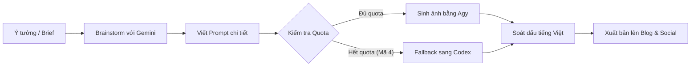
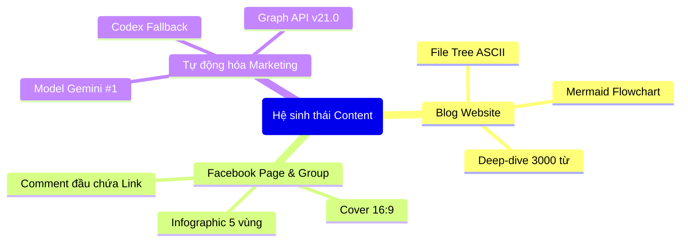

# Output Style — Website Blog Guideline (Hướng dẫn viết bài Blog Website)

> **Mục tiêu:** Style chuẩn cho **bài viết blog chuyên môn, công nghệ và dữ liệu** đăng trên các website (Atlas, CompaClass, Blog cá nhân hoặc Doanh nghiệp).
> Hướng dẫn này định hình văn phong thực chiến, có chiều sâu, kết hợp các **định dạng hiển thị trực quan (Visual Formats)** giúp bài viết chuyên nghiệp, dễ tiếp thu và hấp dẫn người đọc.

---

## 1. VOICE PROFILE (Machine-readable)

```yaml
author: ĐẶT THEO `brand.author` CỦA KÊNH — không viết cứng tên ai vào đây
xung_ho:
  tac_gia: ngôi 3 nhẹ (kể trải nghiệm) HOẶC "mình" (thân mật). KHÔNG dùng "tôi" cứng xuyên suốt.
  doc_gia: "bạn" / "anh chị em" (blog non-tech) — chọn 1 và nhất quán trong 1 bài.
  chung: "chúng ta" / "ta" khi nói về xu thế nhân loại.
rhythm: mix câu dài (giải thích) + câu ngắn cụt (nhấn mạnh). Câu ngắn đứng riêng để chốt ý.
capitalization: chuẩn tiếng Việt. Nhấn mạnh bằng **in đậm**, KHÔNG VIẾT HOA cả câu (trừ tiêu đề bài).
compression: explanation-heavy — luôn giải thích "tại sao", không chỉ liệt kê "cái gì".
questions:
  purpose: mở section + phá vỡ kỳ vọng sai ("Nhưng X không phải là Y"). Hỏi rồi trả lời ngay.
  frequency: vừa phải, không dùng làm bait câu view.
claims: thẳng, có chính kiến, KHÔNG tô hồng. Nêu rõ "tốt cho ai / khó cho ai".
emoji: dùng ở callout + heading phụ (💡🎯⚠️🧠🚀🌿🪄), KHÔNG rải trong thân đoạn văn xuôi.
english_terms: giữ nguyên thuật ngữ (API, MVP, prompt, agent, deploy, repo, semantic model, DAX, RAG…) + giải thích/dịch ngữ cảnh lần đầu xuất hiện.
metaphor: BẮT BUỘC ≥1 ẩn dụ đời thường mỗi bài. Mẫu thật: "đội thợ AI chăm chỉ", "GitHub là xưởng — Netlify là quầy trưng bày", "chưa biết đi xe đạp mà hỏi mua xe phân khối lớn".
never:
  - buzzword rỗng, hype không có depth
  - "AI làm hết, developer nghỉ việc" kiểu giật gân
  - bịa số / bịa tính năng
  - listicle "Top 10 tool xịn nhất"
  - giọng thought-leader LinkedIn sáo rỗng
  - kết luận lửng "tùy nhu cầu" — phải đưa khuyến nghị rõ
```

---

## 2. CẤU TRÚC BÀI CHUẨN

1. **Tiêu đề** — Dạng câu hỏi hoặc câu khẳng định phá vỡ định kiến.
2. **Sapo (Mở bài) — in đậm**, 1–3 câu (Đối lập quá khứ–hiện tại hoặc câu hỏi nhức nhối từ thực tế).
3. **Thân bài** — 5–10 heading **H2**, mỗi H2 có H3 phụ, xen kẽ các định dạng trực quan.
4. **Callout box** — Rải 2–4 khối callout xuyên suốt bài:
   `💡 Nguyên tắc vàng` · `🎯 Mục tiêu` · `⚠️ Sai lầm thường gặp` · `🧠 Điều cần nhớ`
5. **Kết luận** — 1 đoạn ngắn + **1 câu chốt mạnh in đậm** dạng "không phải X, mà là Y".
6. **CTA mềm** — Kết nối, thảo luận hoặc định hướng đón đọc bài tiếp theo.

---

## 3. CÁC ĐỊNH DẠNG TRỰC QUAN (VISUAL FORMATS) TRÊN WEBSITE

Để bài viết không bị khô cứng bởi toàn chữ, Agent PHẢI chủ động sử dụng 3 định dạng trực quan dưới đây khi diễn giải cấu trúc, luồng công việc hoặc khái niệm phức tạp:

### 3.1 Cấu trúc Thư mục (File Tree ASCII)
Dùng khối mã Markdown `text` hoặc `bash` với ký tự ASCII chuẩn (`├──`, `└──`, `│   `) để thể hiện kiến trúc repo, sơ đồ thư mục dự án hoặc cấu trúc dữ liệu.

```text
my-project/
├── .agents/                    # Cấu hình agent và skills
├── scripts/
│   ├── pipeline/               # Runner tự động hóa
│   └── lib/                    # Thư viện dùng chung
├── templates/                  # File mẫu và guidelines
├── tests/                      # Bộ kiểm thử tự động
└── README.md                   # Hướng dẫn dự án
```

### 3.2 Sơ đồ luồng (Flowchart Mermaid.js)
Dùng khối mã `mermaid` với cú pháp `flowchart TD` (từ trên xuống) hoặc `flowchart LR` (từ trái sang phải) để mô tả luồng logic, quy trình nghiệp vụ hoặc kiến trúc hệ thống:



*Quy tắc vẽ Mermaid:*
- Node label luôn bọc trong ngoặc kép `["..."]` để tránh lỗi cú pháp ký tự đặc biệt.
- Sử dụng màu sắc / định dạng đơn giản, tương thích tốt với dark/light mode của website.

### 3.3 Smart-Art & Mindmap (Bản đồ tư duy & Ma trận phân cấp)
Dùng cú pháp Mermaid `mindmap` hoặc bảng ma trận so sánh 3 cột để tổng hợp các khái niệm đa nhánh:



Hoặc bảng ma trận so sánh đối đầu:

| Tiêu chí | Cách làm thủ công | Tự động hóa với Agent Studio |
|---|---|---|
| **Thời gian sản xuất** | 4–6 giờ / bài viết | 15–30 phút (bao gồm cả soát) |
| **Độ đồng bộ nhận diện** | Lệch lạc theo tâm trạng | Chuẩn hóa 100% theo Style Guideline |
| **Khả năng đa kênh** | Đăng chậm, hay quên link | Đồng bộ đồng thời Blog + FB Group + Page |

---

## 4. ĐỘ DÀI & CHIỀU SÂU CHUYÊN MÔN

- **Độ dài bài Deep-dive:** **2.500–4.000 từ**. Đủ chiều sâu để chuyển thể thành kịch bản Podcast hoặc video phân tích.
- **Lăng kính chính kiến 3 lớp (Bắt buộc):**
  1. *Technical:* Công nghệ, kiến trúc, code, công cụ.
  2. *Business Value:* Thời gian, chi phí, lợi ích kinh doanh thực tế.
  3. *Human & Adoption:* Người dùng tiếp nhận thế nào, rào cản thích ứng là gì.
- **Key-term ngành:** Giải thích rõ thuật ngữ tiếng Anh khi xuất hiện lần đầu.
- **Use-case thực tế:** Luôn gắn liền với bài toán của doanh nghiệp hoặc người đi làm tại Việt Nam.

---

## 5. CHECKLIST TRƯỚC KHI XUẤT BẢN (Self-check)

- [ ] Sapo in đậm theo công thức chuẩn?
- [ ] Có ≥1 ẩn dụ (metaphor) đời thường?
- [ ] Có **ít nhất 1 định dạng trực quan** (File Tree ASCII, Sơ đồ luồng Mermaid hoặc Mindmap/Ma trận)?
- [ ] Có 2–4 callout box emoji?
- [ ] Có khối `> **Góc nhìn:**` thể hiện chính kiến tác giả?
- [ ] Câu chốt cuối in đậm dạng "không phải X, mà là Y"?
- [ ] Thuật ngữ tiếng Anh được giải thích lần đầu?
- [ ] Xưng hô nhất quán xuyên suốt bài?
- [ ] Đủ độ sâu chuyên môn và độ dài tiêu chuẩn?
